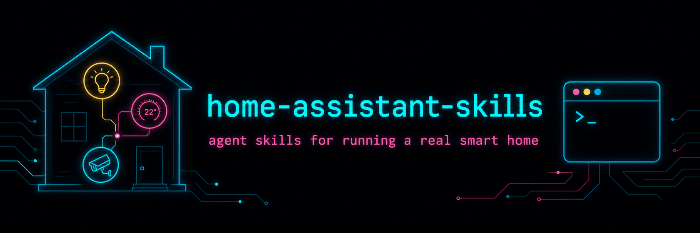

<!-- if this, then that -->

<p align="center">
  
</p>

<p align="center">
  <a href="LICENSE"></a>
  <a href="https://github.com/t3chnaztea/home-assistant-skills/releases"></a>
  
  
  
</p>

<p align="center">
  <b>Years of running a real smart home with coding agents, distilled into agent skills.</b>
</p>

> [Home Assistant](https://www.home-assistant.io) is wonderfully automatable and brutally silent about failure: service calls that no-op, automations that load clean and never fire, triggers that die after the first event. Pointing a coding agent at it without doctrine produces automations that *look* right. This repo packages the doctrine as [Agent Skills](https://agentskills.io): focused, model-readable guides your coding agent (Claude Code and other harnesses) loads on demand when you ask it to work on your smart home.

```
/plugin marketplace add t3chnaztea/home-assistant-skills
/plugin install home-assistant@t3chnaztea-ha
```

## The four skills

Each is a self-contained home for one area. **Start with `ha-connect`**: the
others assume its two access lanes (SSH for files, REST for state) and its
verify doctrine.

<table>
  <tr>
    <td align="center" width="50%" valign="top">
      <a href="skills/ha-connect/SKILL.md"><b>🔌 ha-connect</b></a><br />
      <sub>Start here. The Terminal &amp; SSH add-on, a long-lived token, and the two ways in: SSH for YAML edits, REST for live state and service calls. Curl/ssh recipes and token hygiene.</sub>
    </td>
    <td align="center" width="50%" valign="top">
      <a href="skills/ha-context-map/SKILL.md"><b>🗺️ ha-context-map</b></a><br />
      <sub>The part people skip. The instance map file (verified entity inventory, add-ons, notify targets, and a running Gotchas list) so the agent stops guessing entity ids.</sub>
    </td>
  </tr>
  <tr>
    <td align="center" width="50%" valign="top">
      <a href="skills/ha-automations/SKILL.md"><b>⚙️ ha-automations</b></a><br />
      <sub>English → YAML → <code>ha core check</code> → reload → <b>verify</b>. Before/after reads on every write, and the silent-failure traps: dead notify services, event-entity triggers, no-op writes.</sub>
    </td>
    <td align="center" width="50%" valign="top">
      <a href="skills/ha-external-triggers/SKILL.md"><b>⚡ ha-external-triggers</b></a><br />
      <sub>The "if" doesn't have to be a device: a real-time electricity price driving a load-shed loop, and an LLM as a sensor: camera snapshot + <code>ai_task</code> for judgment calls.</sub>
    </td>
  </tr>
</table>

---

## Why not just use the MCP integration?

Fair question. Home Assistant has an official MCP Server integration, and
HACS has community MCP servers. Point your agent at one and it can read
entity states and call services, scoped to the entities you expose, with no
SSH and no root token. **If that's all you need (control, status questions,
"turn the lights off when I say goodnight"), use MCP.** Less setup, smaller
blast radius, works with local LLMs.

These skills exist for the job MCP can't reach: **administering the
instance.** The MCP surface is state and services; it can't touch config.

| Task | MCP | These skills |
|------|:---:|:---:|
| Read states, call services | ✅ | ✅ |
| Write or refactor `automations.yaml` | ❌ | ✅ |
| `ha core check` before a reload | ❌ | ✅ |
| Tail logs when an automation loads clean but never fires | ❌ | ✅ |
| Grep the config for two automations racing each other | ❌ | ✅ |
| Snapshot/backup before surgery | ❌ | ✅ |

They compose: MCP for day-to-day control, these lanes for admin sessions.
The skills tell the agent the same thing (see "Lane zero" in
[`ha-connect`](skills/ha-connect/SKILL.md)): if a task is purely state reads
and service calls, it doesn't need SSH at all.

---

## ⚠️ Read before you install

**These skills direct an agent to SSH into your Home Assistant box as `root`
and to hold an admin API token.** That is exactly as powerful as it sounds.

- **Review the skills before installing.** They're plain Markdown; read what
  they'll have your agent do. Nothing here phones home or auto-runs; they're
  reference guides. But you are handing an agent an operating manual for the
  thing that controls your house.
- **The token is a root password.** A long-lived access token grants full
  admin. The skills keep it in an env var, never in a file the agent might
  commit or paste. Revoke tokens you stop using.
- **The doctrine is conservative by design:** read before write, validate
  before reload, off-actions over on-actions, and a before/after read on
  every change. But it's your house and your risk.

---

## Install

### Claude Code plugin (recommended)

```
/plugin marketplace add t3chnaztea/home-assistant-skills
/plugin install home-assistant@t3chnaztea-ha
```

The four skills activate automatically when your prompt matches (e.g. "write
an automation that sheds load when electricity spikes", "why does my doorbell
automation never fire").

### Manual copy (any Claude Code, no marketplace)

```bash
git clone https://github.com/t3chnaztea/home-assistant-skills
cp -r home-assistant-skills/skills/ha-* ~/.claude/skills/
```

### Other harnesses

Each `SKILL.md` is harness-neutral Markdown with standard Agent-Skills
frontmatter ([spec](https://agentskills.io/specification)). Drop the
`skills/*` directories wherever your agent framework discovers skills, or
point it at this repo.

---

## What's inside a skill

```
skills/ha-<area>/
  SKILL.md            # the guide (frontmatter + body, < 500 lines)
```

**Markdown only, deliberately.** No scripts to rot, no code to audit before
trusting near your house. Skills ship doctrine plus fenced curl/ssh/YAML
recipes; your agent writes whatever throwaway code the task needs, fresh,
against your actual instance.

Skills are original prose: operational lessons, not a copy of the manual.
The [Home Assistant docs](https://www.home-assistant.io/docs/) remain the
canonical reference; these skills capture what running an instance with
agents teaches you that the docs don't.

## Contributing

Have a hard-won Home Assistant lesson? Copy
[`template/SKILL.md`](template/SKILL.md) and follow its authoring notes:
original prose, instance details parameterized (`<HA_HOST>`, `$HA_TOKEN`,
generic entity ids), markdown only, and show the reader how to verify the
change. PRs welcome.

## Companion repos

- [batocera-skills](https://github.com/t3chnaztea/batocera-skills): the same
  idea for a Batocera retro-gaming cabinet (and the structural template for
  this repo).
- [awesome-psn-skills](https://github.com/t3chnaztea/awesome-psn-skills): the
  same idea for reading a PlayStation play-history export (taste, backlog,
  wishlist).

## Versions

Distilled on Home Assistant OS with Core 2025–2026 releases. HA moves fast
(`triggers:`/`actions:` key renames, `ai_task` is recent); confirm
version-specific claims against `ha core info` on your box. When in doubt,
the instance is the source of truth: read the entity, not the docs.

## License

MIT; see [LICENSE](LICENSE).

> Not affiliated with the Home Assistant project or Nabu Casa. "Home
> Assistant" is used here descriptively; this is an independent,
> community-built collection. The project lives at
> [home-assistant.io](https://www.home-assistant.io).

---

If this, then that. But verified.
